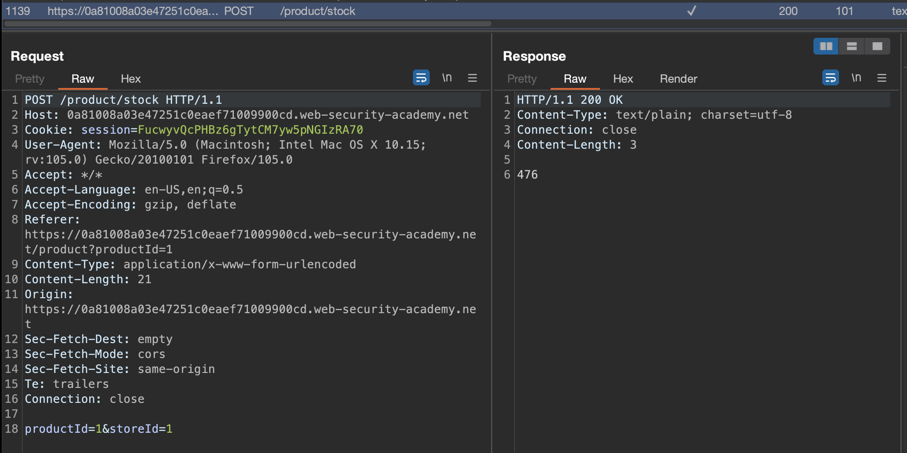

# Intro
This post/writeup is all about the XXE Injection.

I'll be using primarily [Portswigger Web Academy](https://portswigger.net/web-security/xxe) Labs, but i do intent do throw other labs and writeups here as well.

What can we do with XXE-based vulnerabilites:
- retrieve files, where an external entity is defined containing the contents of a file, and returned in the application's response.
- perform SSRF attacks, where an external entity is defined based on a URL to a back-end system.
- exfiltrate data out-of-band, where sensitive data is transmitted from the application server to a system that the attacker controls.
-  retrieve data via error messages, where the attacker can trigger a parsing error message containing sensitive data.

## TOC

# Exploiting XXE using external entities to retrieve files

>  This lab has a "Check stock" feature that parses XML input and returns any unexpected values in the response.
> 
> To solve the lab, inject an XML external entity to retrieve the contents of the /etc/passwd file. 

Checking the instructions, we're supposed to check the `Check stock` feature, so let's do that and have Burp running in the background.

  

That's the payload that will be used:
```
<?xml version="1.0" encoding="UTF-8"?>
<!DOCTYPE foo [ <!ENTITY xxe SYSTEM "file:///etc/passwd"> ]>
<stockCheck><productId>&xxe;</productId>
<storeId>&xxe;</storeId>
</stockCheck>
```

  

And we'we got the contents of `/etc/passwd` back!

# Exploiting XXE to perform SSRF attacks
>  This lab has a "Check stock" feature that parses XML input and returns any unexpected values in the response.
> 
> The lab server is running a (simulated) EC2 metadata endpoint at the default URL, which is http://169.254.169.254/. This endpoint can be used to retrieve data about the instance, some of which might be sensitive.
> 
> To solve the lab, exploit the XXE vulnerability to perform an SSRF attack that obtains the server's IAM secret access key from the EC2 metadata endpoint. 

We have to try to achieve SSRF, so let's start with checking the `Check stock` feature:

  

Let's try to exploit SSRF using XXE Vulnerability

  

We can see that we get `latest` return which is folder. We can get to admin-key in few iterations:

  

As soon as we reach the secret access key, lab will get solved.

# Exploiting XInclude to retrieve files
>  This lab has a "Check stock" feature that embeds the user input inside a server-side XML document that is subsequently parsed.
> 
> Because you don't control the entire XML document you can't define a DTD to launch a classic XXE attack.
> 
> To solve the lab, inject an XInclude statement to retrieve the contents of the /etc/passwd file. 

We know that `Check stock` is vulnerable, so let's use it and check the request in Burp.

  

We will inject the payload inthe the `productId` value:

```xml
<foo xmlns:xi="http://www.w3.org/2001/XInclude"><xi:include parse="text" href="file:///etc/passwd"/></foo>
```

  

Lab has been solved!

# Exploiting XXE via image file upload

>  This lab lets users attach avatars to comments and uses the Apache Batik library to process avatar image files.
> 
> To solve the lab, upload an image that displays the contents of the /etc/hostname file after processing. Then use the "Submit solution" button to submit the value of the server hostname. 

In this lab we have to upload malicious SVG as avatar. We have to create SVG File beforehand:

```xml
<?xml version="1.0" standalone="yes"?><!DOCTYPE test [ <!ENTITY xxe SYSTEM "file:///etc/hostname" > ]><svg width="128px" height="128px" xmlns="http://www.w3.org/2000/svg" xmlns:xlink="http://www.w3.org/1999/xlink" version="1.1"><text font-size="16" x="0" y="16">&xxe;</text></svg>
```

Save that as SVG and upload as avatar:
  

When checking the avatar on the post, image with file contents should appear.

  

Submit hostname as solution in order to solve the lab.