# Intro
This post/writeup is all about the DOM-Based XSS Vulnerabilities.

I'll be using primarily [Portswigger Web Academy](https://portswigger.net/web-security/dom-based) Labs, but i do intent do throw other labs and writeups here as well.

To learn more on the topic, please visit the article linked above at Portswigger's.

## TOC
- [Intro](#intro)
  - [TOC](#toc)
- [DOM XSS in document.write sink using source location.search](#dom-xss-in-documentwrite-sink-using-source-locationsearch)
- [DOM XSS in document.write sink using source location.search inside a select element](#dom-xss-in-documentwrite-sink-using-source-locationsearch-inside-a-select-element)
- [DOM XSS in innerHTML sink using source location.search](#dom-xss-in-innerhtml-sink-using-source-locationsearch)
- [DOM XSS in jQuery anchor href attribute sink using location.search source](#dom-xss-in-jquery-anchor-href-attribute-sink-using-locationsearch-source)
- [DOM XSS in jQuery selector sink using a hashchange event](#dom-xss-in-jquery-selector-sink-using-a-hashchange-event)
- [DOM XSS in AngularJS expression with angle brackets and double quotes HTML-encoded](#dom-xss-in-angularjs-expression-with-angle-brackets-and-double-quotes-html-encoded)
- [Reflected DOM XSS](#reflected-dom-xss)
- [Stored DOM XSS](#stored-dom-xss)


# DOM XSS in document.write sink using source location.search
> This lab contains a DOM-based cross-site scripting vulnerability in the search query tracking functionality. It uses the JavaScript document.write function, which writes data out to the page. The document.write function is called with data from location.search, which you can control using the website URL.
> 
> To solve this lab, perform a cross-site scripting attack that calls the alert function.

I'll be using DOM Invader to find the sink. We basically put a string and if found in the DOM it should be shown in the DOM invader. In order to use the DOM Invader, Burp's integrated browser has to be used.

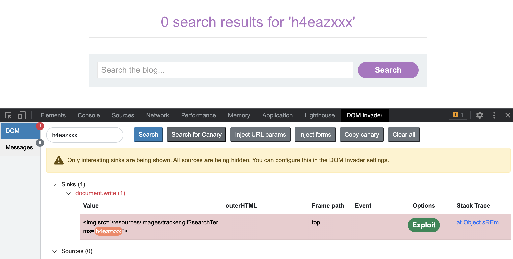  

XSS Exploitation here is straightforward: `">`

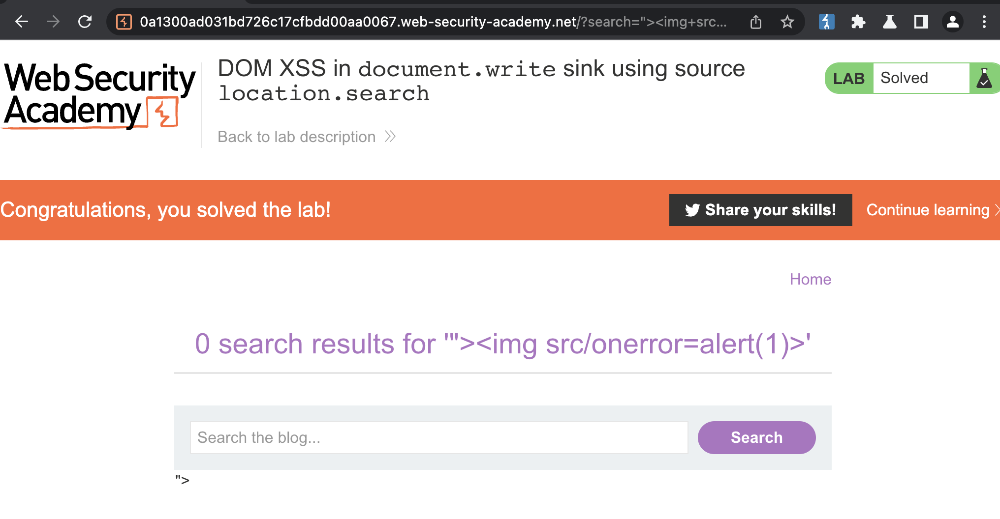  


# DOM XSS in document.write sink using source location.search inside a select element
> This lab contains a DOM-based cross-site scripting vulnerability in the stock checker functionality. It uses the JavaScript document.write function, which writes data out to the page. The document.write function is called with data from location.search which you can control using the website URL. The data is enclosed within a select element.
> 
> To solve this lab, perform a cross-site scripting attack that breaks out of the select element and calls the alert function.

This lab has the same optics than the previous lab, hence no screenshot :).

So we already know what source and sinks are supposed to be BUT let's check DOM invader. If we select a post, sink (and source if selected in DOM Invder options) will show up.

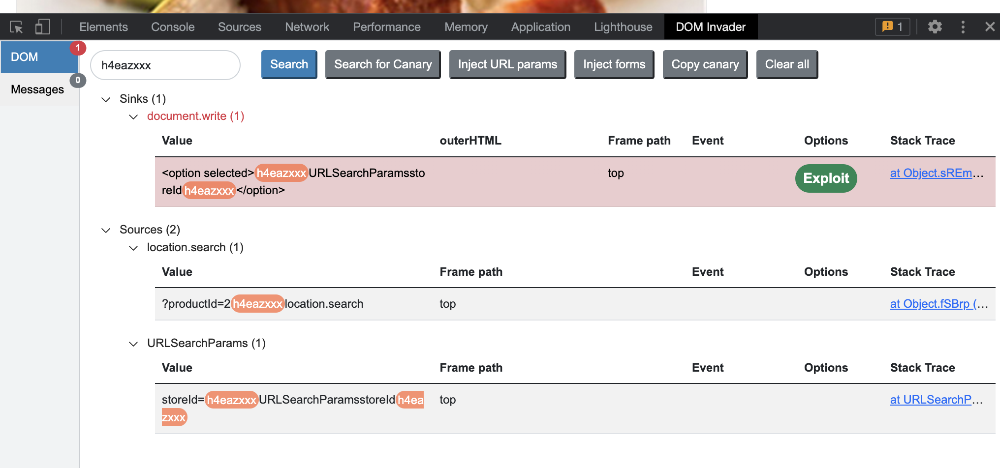  

Injecting into `productId` did not work, into `storeId` URL parameter did however work, so the website gets loaded dynamically and outputs our input onto the page.

For example, if we issue following GET request: `https://0a1600de0322ee00c09ea9f800bc00da.web-security-academy.net/product?productId=4&storeId=canary` it'll render option element

```html
<option selected="">canaryh4eazxxxlocation.searchh4eazxxxURLSearchParamsstoreIdh4eazxxx</option>
```

Now can we make an `alert` fire?

... Yes we can!

```
https://0a1600de0322ee00c09ea9f800bc00da.web-security-academy.net/product?productId=4&storeId=<script>alert(1)</script>
```

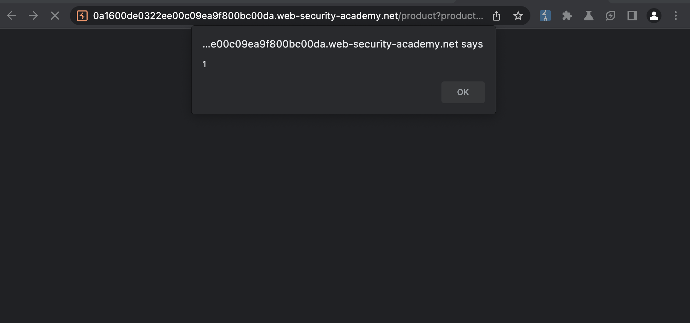  

Alternatively we could do it like this, so HTML will not break.

```html
storeId="></select>
```

# DOM XSS in innerHTML sink using source location.search
> This lab contains a DOM-based cross-site scripting vulnerability in the search blog functionality. It uses an innerHTML assignment, which changes the HTML contents of a div element, using data from location.search.
> 
> To solve this lab, perform a cross-site scripting attack that calls the alert function.

Here i will also use DOM Invader,

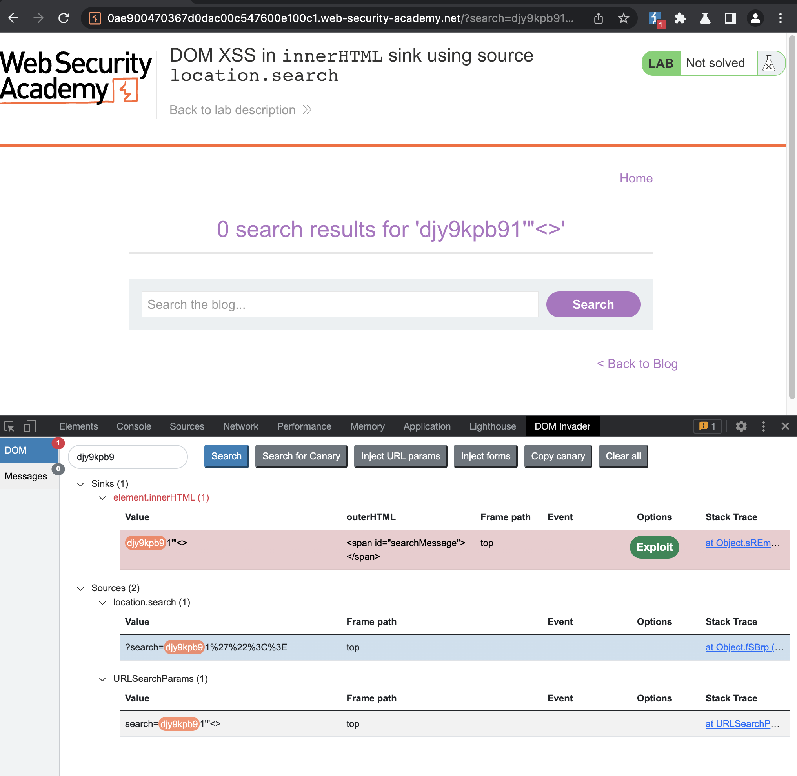  

We see the source `location.search` and the sink `innerHTML`.

We can use simple XSS payload to trigger the alert!

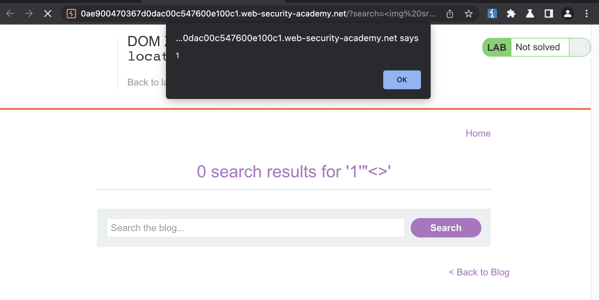  

# DOM XSS in jQuery anchor href attribute sink using location.search source
> This lab contains a DOM-based cross-site scripting vulnerability in the submit feedback page. It uses the jQuery library's $ selector function to find an anchor element, and changes its href attribute using data from location.search.
> 
> To solve this lab, make the "back" link alert document.cookie.


In this lab i will also be using DOM invader. If we go to `Submit Feedback` and send submit the form, we'll notice a `returnPath` parameter, and this is getting passed (or getting read) in DOM.

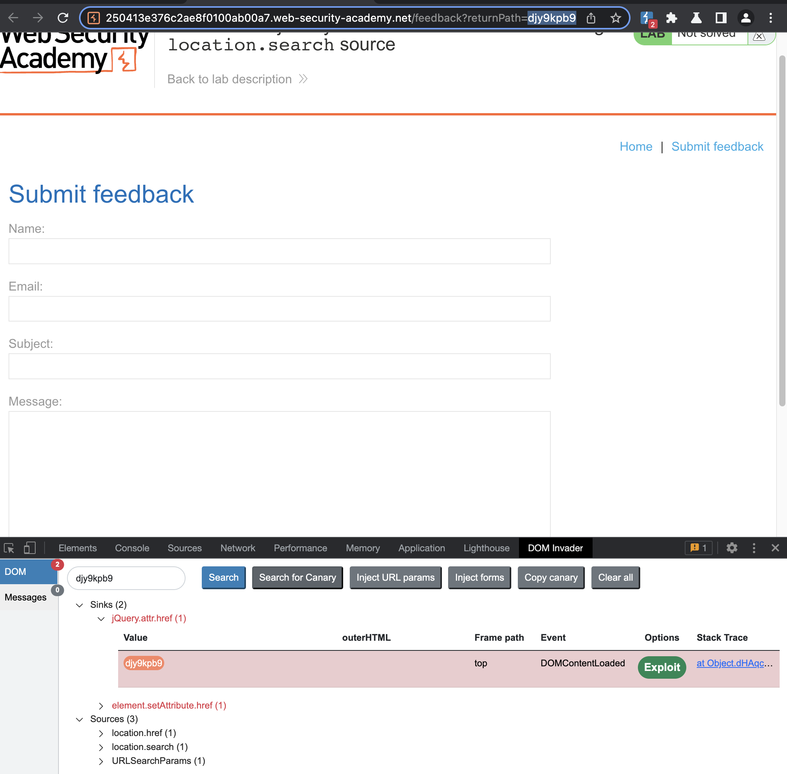

We can inject javascript into `returnPath` parameter and alert should fire when `back` is clicked.

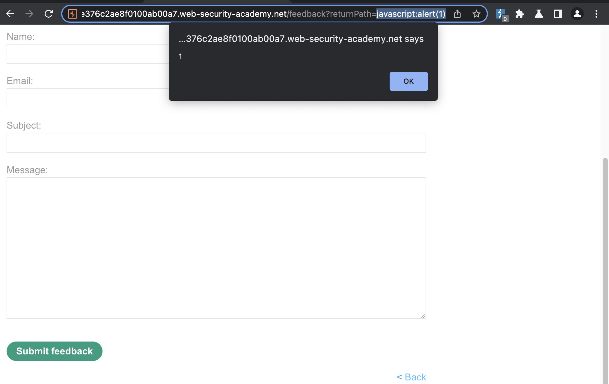  

# DOM XSS in jQuery selector sink using a hashchange event
> This lab contains a DOM-based cross-site scripting vulnerability on the home page. It uses jQuery's $() selector function to auto-scroll to a given post, whose title is passed via the location.hash property.
> 
> To solve the lab, deliver an exploit to the victim that calls the print() function in their browser.

In this lab, if we pay attention to DOM Invader, we will notice that source has been found.

  

If we search for `location.href`, we'll find this entry

```html
<script>
                        $(window).on('hashchange', function(){
                            var post = $('section.blog-list h2:contains(' + decodeURIComponent(window.location.hash.slice(1)) + ')');
                            if (post) post.get(0).scrollIntoView();
                        });
                    </script>
```

This will load title of the post into `$()`.

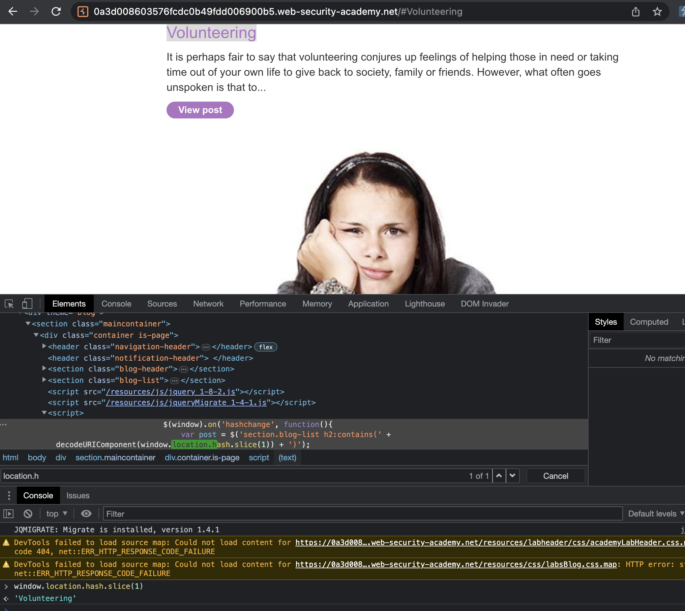  

If we attach simple XSS payload the `print()` should open.

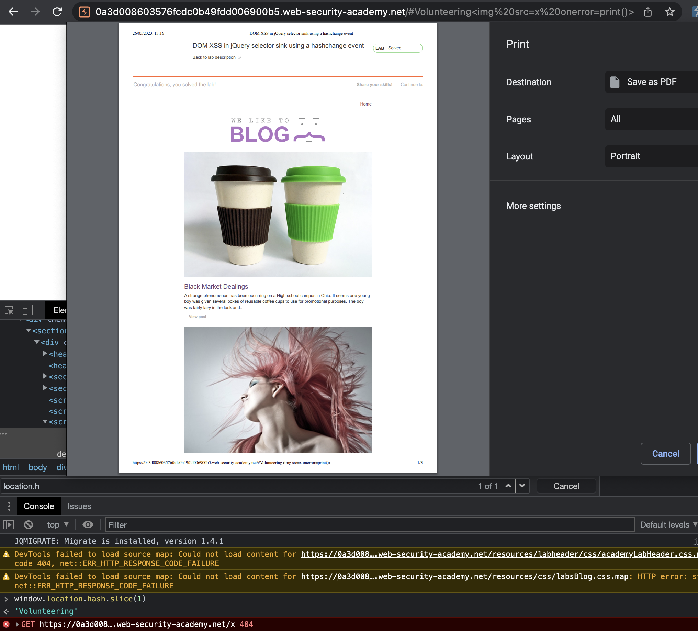  

Payload for victim used:

```html
<iframe src="https://0a3d008603576fcdc0b49fdd006900b5.web-security-academy.net/#" onload="this.src+=''"></iframe>
```

This fired a `print()`.


I highly recommend checking this video: https://www.youtube.com/watch?v=JgiX3kyK8ME

# DOM XSS in AngularJS expression with angle brackets and double quotes HTML-encoded
> This lab contains a DOM-based cross-site scripting vulnerability in a AngularJS expression within the search functionality.
> 
> AngularJS is a popular JavaScript library, which scans the contents of HTML nodes containing the ng-app attribute (also known as an AngularJS directive). When a directive is added to the HTML code, you can execute JavaScript expressions within double curly braces. This technique is useful when angle brackets are being encoded.
> 
> To solve this lab, perform a cross-site scripting attack that executes an AngularJS expression and calls the alert function.

I'll again make use of DOM invader to identify sinks and sources.

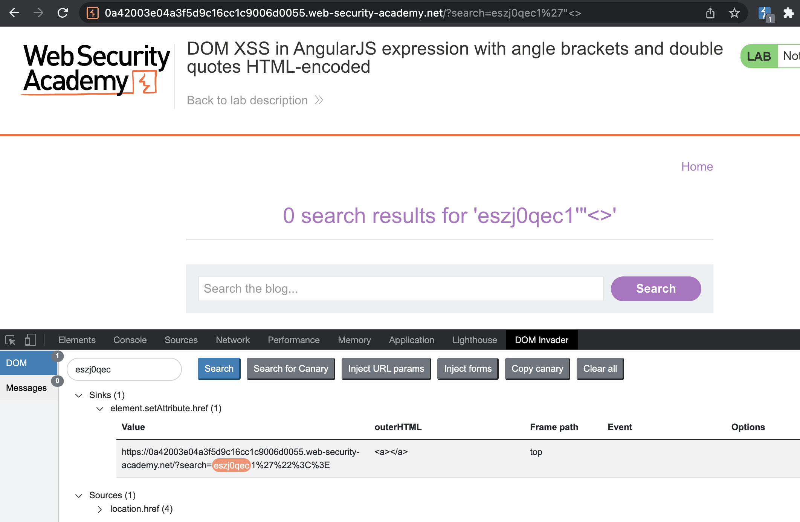  

Payload:

```
{{constructor.constructor('alert(1)')()}}
```

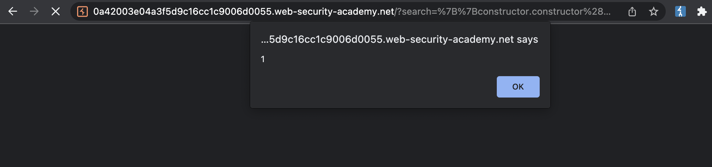  

Cheatsheet: https://portswigger.net/web-security/cross-site-scripting/cheat-sheet (search for "Angular")

# Reflected DOM XSS
> This lab demonstrates a reflected DOM vulnerability. Reflected DOM vulnerabilities occur when the server-side application processes data from a request and echoes the data in the response. A script on the page then processes the reflected data in an unsafe way, ultimately writing it to a dangerous sink.
> 
> To solve this lab, create an injection that calls the alert() function.

For this lab i will once again, use DOM invader. 

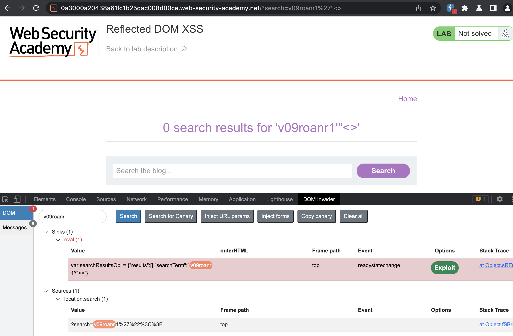  

We have got the sink and the source. Dom invader clearly states that sink is in `eval` function, source however is taken from `location.search`, hence it is returned from the server (= Reflected).

Notice the `eval` function and `this.responseText`

```js
function search(path) {
    var xhr = new XMLHttpRequest();
    xhr.onreadystatechange = function() {
        if (this.readyState == 4 && this.status == 200) {
            eval('var searchResultsObj = ' + this.responseText);
            displaySearchResults(searchResultsObj);
        }
    };
    xhr.open("GET", path + window.location.search);
    xhr.send();

    function displaySearchResults(searchResultsObj) {
        var blogHeader = document.getElementsByClassName("blog-header")[0];
        var blogList = document.getElementsByClassName("blog-list")[0];
        var searchTerm = searchResultsObj.searchTerm
        var searchResults = searchResultsObj.results

        var h1 = document.createElement("h1");
        h1.innerText = searchResults.length + " search results for '" + searchTerm + "'";
        blogHeader.appendChild(h1);
```


There is no fast way to exploit this, exept try and error to escape the escaped characters. Fortunately backslash is not escaped and we can break out of what is supposed to be a string. Do note that there should be no spaces in the payload.

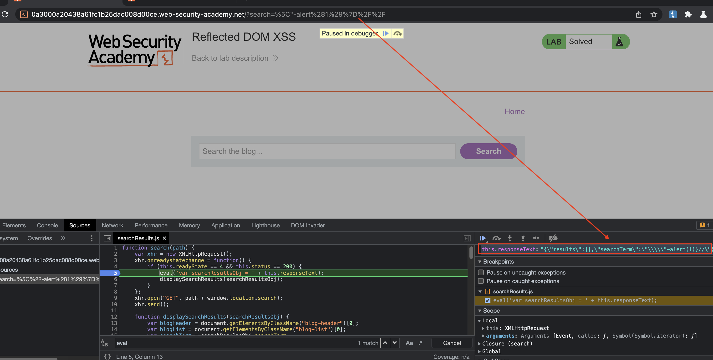  

So let us try to trigger an alert using following payload:

Payload
```
\"-alert(1)}//
```

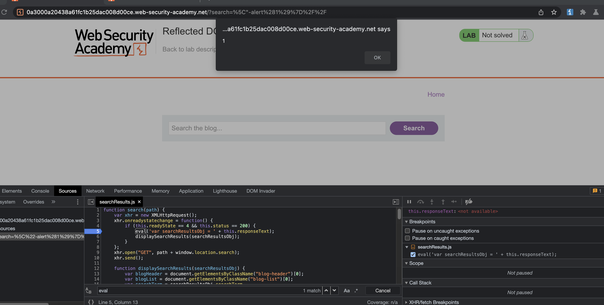  

Alert has fired! Lab has been solved.

# Stored DOM XSS
> This lab demonstrates a stored DOM vulnerability in the blog comment functionality. To solve this lab, exploit this vulnerability to call the alert() function.

Payload:
```
<>
```

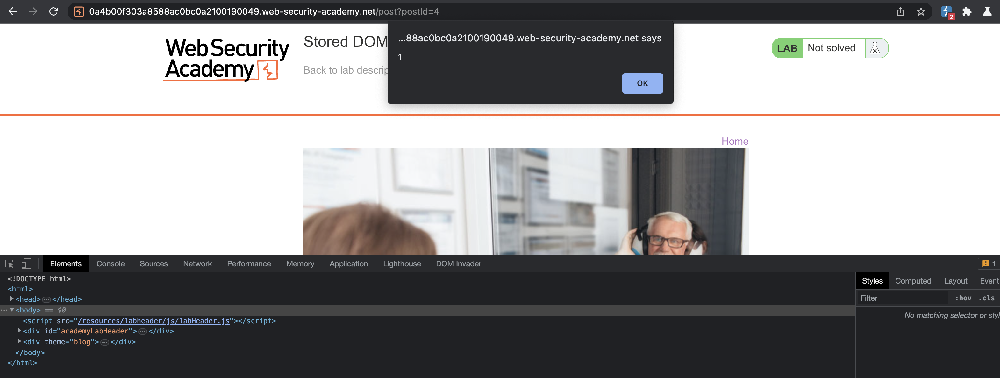  

If we check the DOM what's going on we will see following

```html
<p>&lt;&gt;</p>
```

This is the explanation from Portswigger:
> In an attempt to prevent XSS, the website uses the JavaScript replace() function to encode angle brackets. However, when the first argument is a string, the function only replaces the first occurrence. We exploit this vulnerability by simply including an extra set of angle brackets at the beginning of the comment. These angle brackets will be encoded, but any subsequent angle brackets will be unaffected, enabling us to effectively bypass the filter and inject HTML.
>
> Reference: https://portswigger.net/web-security/cross-site-scripting/dom-based/lab-dom-xss-stored

This is the vulnerable function:

```js
 function escapeHTML(html) {
        return html.replace('<', '&lt;').replace('>', '&gt;');
    }
```
