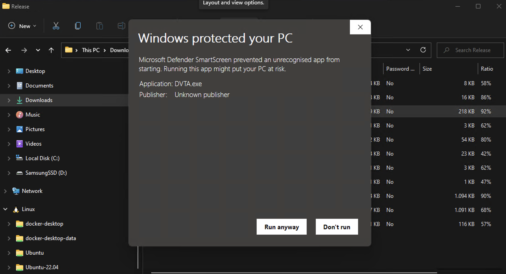
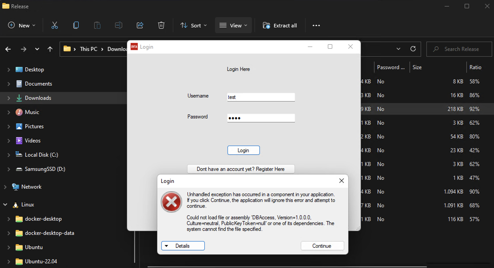
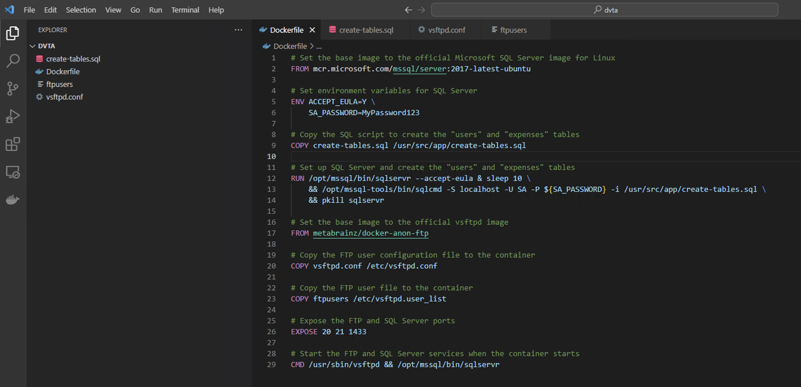
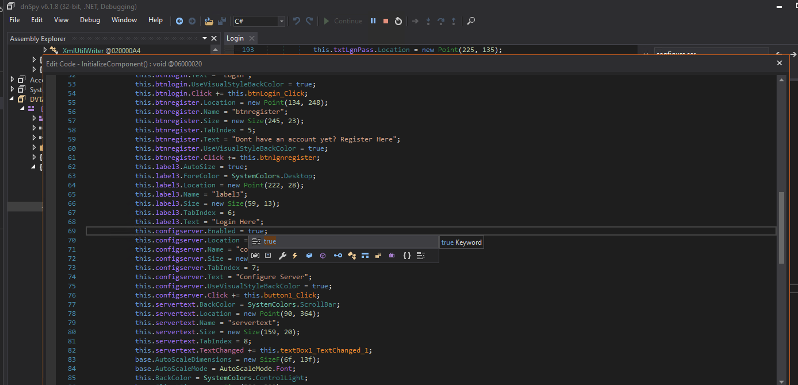

Go to github, download 
Go to binaries and run

  

Just see if app runs, but we need a running database, obviously...

  

Docker build

  

```
docker build --pull --rm -f "Dockerfile" -t dvta.latest "." 
```

```
docker run --rm -d -p 1433:1433/tcp -p 20:20/tcp -p 21:21/tcp -p 65500:65500/tcp -p 65501:65501/tcp -p 65502:65502/tcp -p 65503:65503/tcp -p 65504:65504/tcp -p 65505:65505/tcp -p 65506:65506/tcp -p 65507:65507/tcp -p 65508:65508/tcp -p 65509:65509/tcp -p 65510:65510/tcp -p 65511:65511/tcp -p 65512:65512/tcp -p 65513:65513/tcp -p 65514:65514/tcp -p 65515:65515/tcp dvta:latestt
```

Recompile

  
